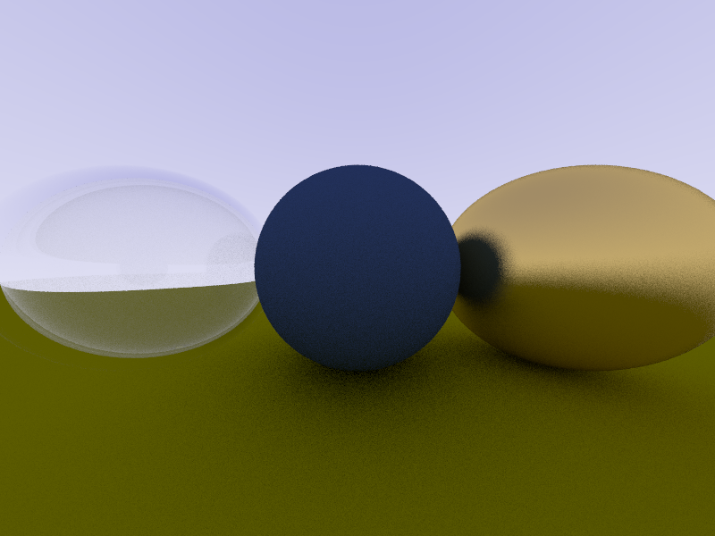
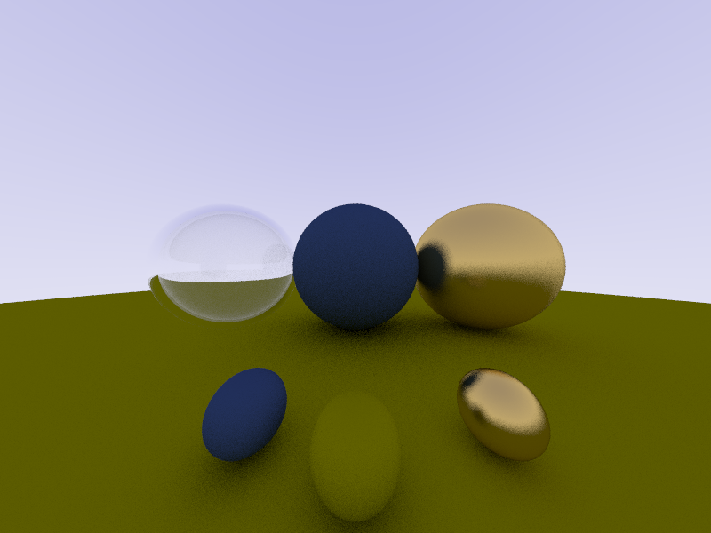
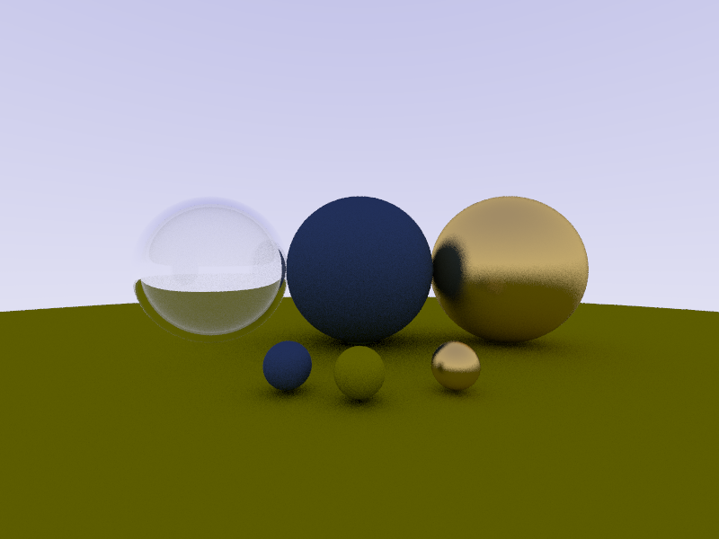

## General info	
Simple ray-tracer in golang, build without any additional libraries. Currently supports only spheres.

## Technologies
None, only pure golang.

## Images

## TODO 
Add triangle shapes, light sources, better goroutines.

